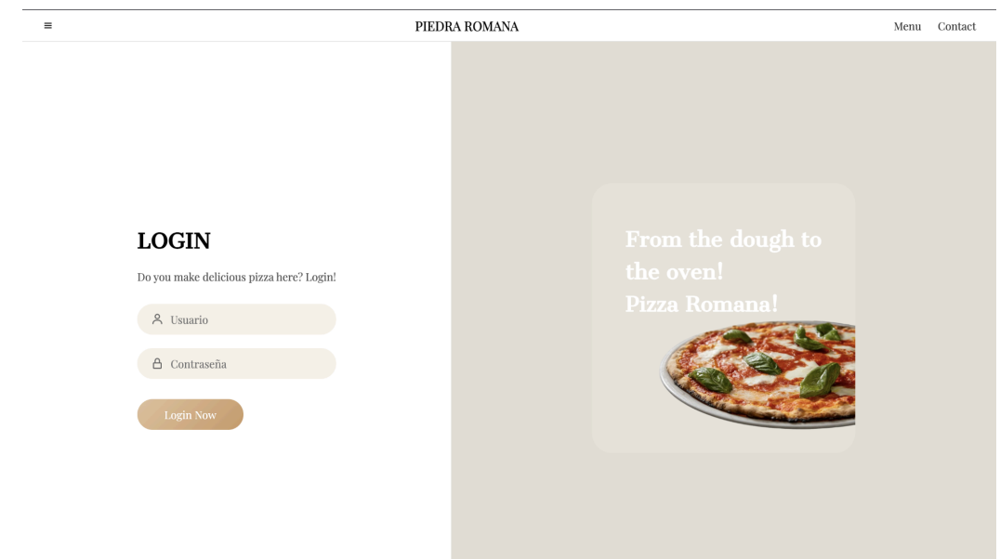
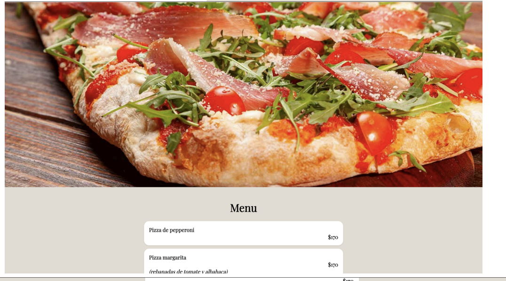
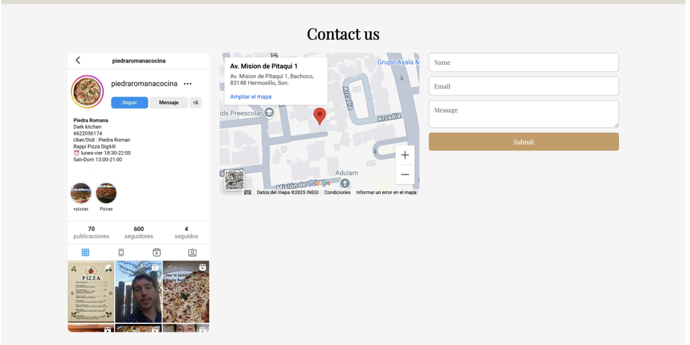
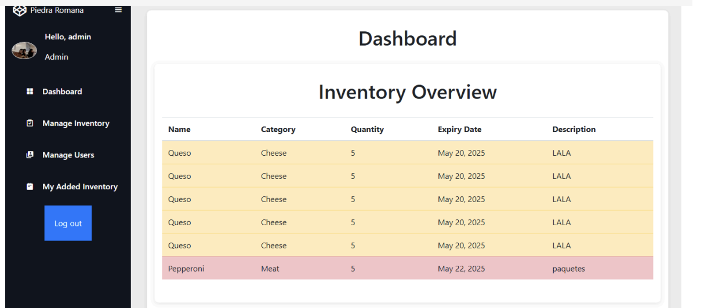
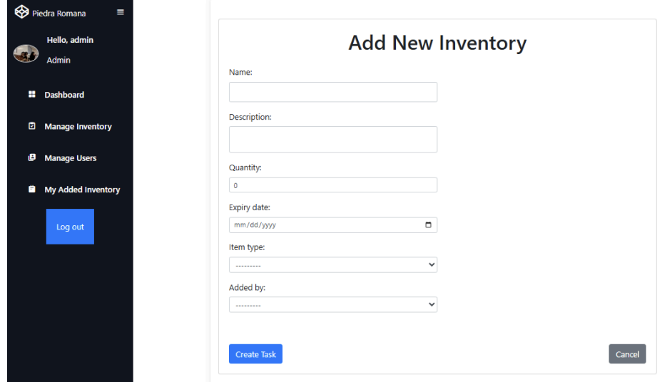
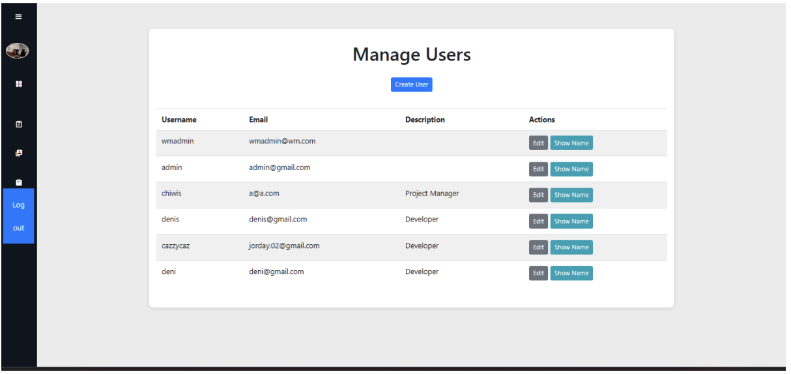

# 🍕 ProyectoPizzas

**Proyecto académico desarrollado para la materia de Tópicos Avanzados Ciencias de la computación**  
Aplicación web construida con **Django** que simula un sistema de gestión para una pizzería, incluyendo usuarios, tareas internas y control de inventario.

---

## Objetivo

Desarrollar una plataforma sencilla que permita:
- Gestionar usuarios (empleados y administradores)
- Asignar y dar seguimiento a tareas
- Controlar productos y su inventario
- Autenticación y autorización con soporte para redes sociales

---

## 🛠 Tecnologías utilizadas

- Python 3.10+
- Django 5.2
- Django Extensions
- PostgreSQL (puede configurarse otro motor)
- Bootstrap (para estilos)
- Autenticación social con OAuth (Google, GitHub, etc.)
- HTML5, CSS3 y JavaScript

---

## Instalación y configuración

### 1. Clonar el repositorio

```bash
git clone https://github.com/ana-chenoweth/ProyectoPizzas.git
cd ProyectoPizzas
```

### 2. Crear entorno virtual

```bash
python -m venv env
source env/bin/activate  # En Windows: env\Scripts\activate
```

### 3. Instalar dependencias

```bash
pip install -r requirements.txt
```

> Requerimientos (Para correr la aplicación se deberá tener python y crear un ambiente virtual en el cual se instale lo siguiente):

```text
asgiref==3.8.1
certifi==2025.1.31
cffi==1.17.1
charset-normalizer==3.4.1
cryptography==44.0.2
defusedxml==0.7.1
Django==5.2
django-extensions==4.1
idna==3.10
oauthlib==3.2.2
pycparser==2.22
PyJWT==2.10.1
python-dotenv==1.1.0
python3-openid==3.2.0
requests==2.32.3
requests-oauthlib==2.0.0
social-auth-app-django==5.4.3
social-auth-core==4.5.6
sqlparse==0.5.3
tzdata==2025.2
urllib3==2.4.0
```

### 4. Aplicar migraciones

```bash
python manage.py makemigrations
python manage.py migrate
```

### 5. Ejecutar el servidor

```bash
python manage.py runserver
```

---

## Funcionalidades implementadas

- ✔ Registro e inicio de sesión de usuarios
- ✔ Creación y seguimiento de tareas por usuario
- ✔ Control básico de inventario de productos
- ✔ Roles diferenciados para administración y otros usuarios
- ✔ Integración con proveedores de autenticación social (Google, GitHub)

---

## Capturas 
### Inicio de sesión


### Página principal




### Inventario


Tambien esta el de editar y eliminar

### Usuarios
Para este solo el rol de administrador tiene permitido esta funcionalidad.

---

## 📁 Estructura del proyecto

```
ProyectoPizzas/
├── base/               # Aplicación principal
│   ├── models.py
│   ├── views.py
│   ├── templates/
│   └── urls.py
├── tasks/              # Módulo para gestión de tareas
├── workmates/          # Módulo para usuarios y roles
├── ProyectoPizzas/     # Configuración global del proyecto
├── static/
├── templates/
├── manage.py
```

---

## 👩‍💻 Autoría y colaboradores

Este proyecto fue desarrollado por:

- Ana Chenoweth ([@ana-chenoweth](https://github.com/ana-chenoweth))
- Denisse Gabriela Antunez López ([@denisseantunez](https://github.com/denisseantunez))
- Georgina Salcido Valenzuela ([@GeoSV](https://github.com/GeoSV))

---

## 📄 Licencia

Este proyecto se distribuye bajo la Licencia MIT.
